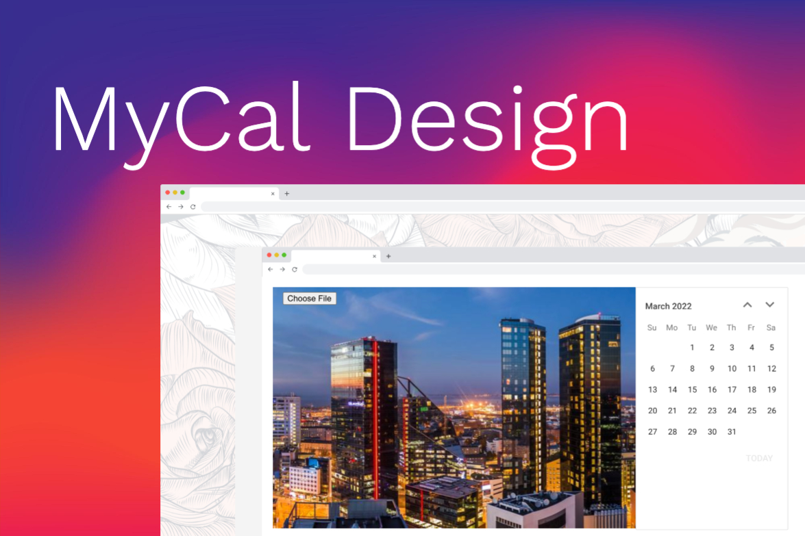

MyCal Design

MyCal Design is a web application for creating custom photo calendars. User can print out or save their creation. Options to customize calendar months are adding their own image and marking in important personal dates.

Project's tech stack includes React, Axios, Node with Express server, Multer and MongoDB Mongoose database.

To start the app:

1. Cd into 'server' directory and run 'npm i' to install the following dependencies:
Express
body-parser
Cors
Mongoose
multer
uuid

2. run 'nodemon index.js' command from /server directory to start the server.
3. start Mongo DB.
4. Cd into 'client' directory and run 'npm i' to install fron end dependencies:
@react-pdf/renderer
@syncfusion/ej2-react-calendars
axios
react-to-print

5. run 'npm start' from /client directory.

6. You're ready to enjoy MyCal!
